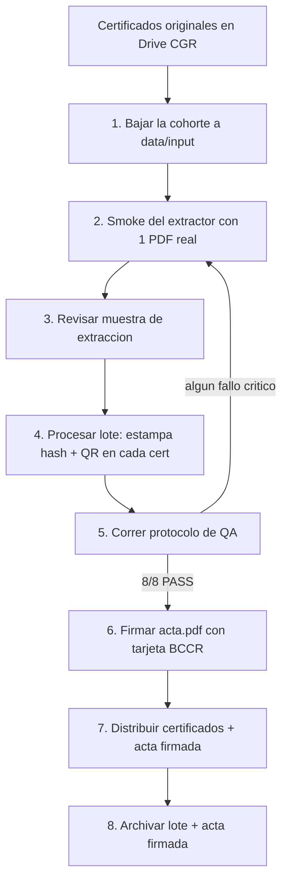

# Procedimiento oficial — Emisión de certificados con acta única firmada digitalmente

**Unidad:** Centro de Capacitación · División de Gestión de Apoyo · Contraloría General de la República
**Responsable / firmante autorizado:** Lic. Juan Alejandro Herrera López (Jefatura A.I)
**Versión:** 1.0 (borrador para adopción) · **Fecha:** 2026-05-29
**Estado:** fase piloto — propuesto para adopción como mecanismo oficial
**Documentos de respaldo:** `CONSTITUTION.md`, `docs/architecture/adr-0001-hash-sin-cedula.md`, `docs/qa/protocolo_qa_emision_certificados.md`, `docs/qa/reporte_qa_20260529.md`

---

## 1. Propósito

Establecer el procedimiento mediante el cual el Centro de Capacitación emite certificados de participación de forma **legalmente verificable** y **trazable**, sin requerir una firma digital por cada certificado.

En lugar de firmar N certificados, la Jefatura firma digitalmente **una sola acta** que contiene la lista de los códigos criptográficos (hash SHA-256) de todos los certificados de una cohorte. Cada certificado lleva impreso su propio código, de modo que cualquier tercero puede verificar su autenticidad comparándolo contra el acta firmada.

## 2. Definiciones

| Término | Significado |
|---|---|
| **Certificado** | Documento PDF de participación emitido a un participante de un curso. |
| **Hash SHA-256** | Código de 64 caracteres hexadecimales calculado a partir del contenido visible del certificado. Cambia por completo ante cualquier modificación del contenido (efecto avalancha). |
| **String canónico** | Texto que concatena los 8 datos visibles del certificado, normalizado, sobre el que se calcula el hash. |
| **Acta única** | Documento PDF que lista, para una cohorte, el nombre del participante y el hash de su certificado. Es el documento que se firma digitalmente. |
| **Cohorte / lote** | Conjunto de certificados de un mismo curso/grupo procesados juntos. |
| **Verificador** | Tercero (auditoría, recursos humanos, otra institución) que comprueba la autenticidad de un certificado. |

## 3. Fundamento del mecanismo (justificación)

### 3.1 Por qué es válido

1. **Integridad criptográfica.** El hash SHA-256 es una función unidireccional de la familia estándar. Cualquier alteración del certificado —un nombre, una fecha, las horas, la modalidad— produce un hash completamente distinto. Es computacionalmente inviable fabricar un certificado distinto que produzca el mismo hash. *(Verificado en QA-07, efecto avalancha.)*

2. **Una firma, fe de todo el lote.** El acta lista los hashes de todos los certificados de la cohorte. Al firmarla digitalmente la Jefatura, la firma da fe institucional simultánea de **todos** los certificados allí registrados. Alterar un solo certificado lo desincroniza de su entrada en el acta y el fraude queda en evidencia.

3. **Verificable por un tercero con solo el papel.** El código se calcula exclusivamente a partir de datos **visibles** en el certificado (sin cédula ni datos externos — ver ADR-0001). Por tanto, un verificador que tenga el certificado en mano y acceso al acta firmada puede recalcular el hash y confirmar la coincidencia, sin necesidad de consultar ninguna base de datos del Centro. *(Verificado en QA-03 sobre los 16 certificados estampados.)*

4. **Trazabilidad.** Cada emisión genera un registro reproducible (listado de hashes + manifiesto con fecha, versión del algoritmo, total de certificados y el sello SHA-256 del propio listado). *(Verificado en QA-05.)*

### 3.2 Marco normativo de referencia

- **Ley N.º 8454, Ley de Certificados, Firmas Digitales y Documentos Electrónicos**, y su reglamento: reconocen la equivalencia funcional del documento electrónico firmado digitalmente con el documento en papel, y la firma digital certificada (BCCR) como mecanismo de autoría e integridad. El acta única se firma con el certificado digital del BCCR de la Jefatura, quedando amparada por este marco.
- **Política institucional de la CGR** sobre gestión documental y control interno: el procedimiento produce evidencia trazable y reproducible de cada emisión.

> El presente procedimiento cubre la **generación y verificación** de certificados y acta. La **validez jurídica de la firma digital** recae en el certificado del BCCR del firmante y su correcta aplicación, no en este sistema.

### 3.3 Garantías validadas por QA

El mecanismo fue sometido a un protocolo de QA reproducible (`docs/qa/protocolo_qa_emision_certificados.md`), ejecutado el 2026-05-29 con resultado **8/8 casos PASS, 0 fallos críticos** (`docs/qa/reporte_qa_20260529.md`): cobertura total del lote, determinismo, verificación por tercero, idempotencia, integridad del listado, no-alteración de originales, sensibilidad del hash y normalización de acentos.

## 4. Roles y responsabilidades

| Rol | Quién | Responsabilidad |
|---|---|---|
| **Operador** | Jefatura A.I (fase piloto) | Ejecuta el pipeline, revisa la muestra de extracción, corre el QA. |
| **Firmante autorizado** | Lic. Juan Alejandro Herrera López | Único autorizado a firmar digitalmente el acta con su tarjeta BCCR. |
| **Verificador** | Tercero (auditoría, RH, externos) | Recalcula el hash de un certificado y lo compara contra el acta firmada. |
| **Custodio de originales** | CGR (Drive institucional) | Resguarda los certificados originales. El sistema solo los lee. |

## 5. Procedimiento de emisión (paso a paso)



| Paso | Acción | Control | Herramienta |
|---|---|---|---|
| 1 | Descargar la cohorte desde la carpeta autorizada del Drive a `data/input/` | Solo lectura del Drive; no se tocan originales | App (Paso 1) o `bajar_certificados.py` |
| 2 | Smoke del extractor con 1 certificado real | Los 8 campos no vacíos | `smoke_extractor.py` |
| 3 | Revisar la muestra de extracción (3 certificados) | El operador confirma que nombre/curso/fechas son correctos | App (Paso 2) |
| 4 | Procesar el lote: estampar hash + QR en cada certificado y generar el listado, el manifiesto y el `acta.pdf` | 16/16 sin error | App (Paso 3) o `generar_acta.py` + `generar_pdf_acta.py` |
| 5 | Ejecutar el protocolo de QA | **8/8 PASS, 0 críticos** antes de firmar | `qa_suite.py` |
| 6 | Abrir `acta.pdf` en el firmador del BCCR y aplicar firma digital | Paso humano; única firma del lote | Firmador BCCR (fuera del sistema) |
| 7 | Entregar a cada participante su certificado estampado; poner a disposición el acta firmada para verificación | — | Distribución institucional |
| 8 | Archivar el lote completo y el acta firmada según política de gestión documental | Conservación de la evidencia | CGR |

> **Regla de oro:** **no se firma un acta cuyo lote no haya pasado el QA con 8/8 críticos** (paso 5 → paso 6).

## 6. Qué contiene cada certificado estampado

- La **leyenda** "Acta firmada digitalmente".
- El **hash SHA-256** del certificado, impreso y legible.
- La **etiqueta** "Código de verificación (SHA-256):".
- Un **código QR** (esquina superior-izquierda) con `{nombre, hash, versión}` para verificación visual rápida desde el móvil.

El diseño histórico del certificado se preserva; el estampado se superpone sin alterar el contenido original (verificado: la extracción del PDF estampado sigue produciendo el mismo hash, QA-03).

## 7. Qué contiene el acta

- Encabezado institucional CGR.
- Metadatos: curso, fecha de emisión, total de certificados, versión del algoritmo, identificador del lote, fecha de generación y **SHA-256 del propio listado**.
- Prosa institucional que declara la fe del firmante sobre el lote.
- **Tabla**: Nº · Participante · Hash SHA-256 del certificado.
- Pie con el firmante autorizado (espacio para la firma digital BCCR).

## 8. Procedimiento de verificación por un tercero

Un verificador que recibe un certificado y desea comprobar su autenticidad:

1. Obtiene el **acta firmada** de la cohorte (canal institucional) y comprueba que la **firma digital BCCR es válida** (con el visor/validador del BCCR).
2. **Opción rápida:** escanea el **QR** del certificado y compara el hash mostrado con el de la tabla del acta.
3. **Opción formal:** recalcula el hash a partir de los datos visibles del certificado y lo compara con la entrada del acta:
   ```powershell
   python scripts/verificar.py <certificado.pdf> <hash_esperado_del_acta>
   ```
   - Coincide → certificado **auténtico** e **íntegro**.
   - No coincide → certificado **alterado** o no emitido por el Centro.

> El verificador **no necesita** acceso a ninguna base de datos del Centro: el certificado se autoverifica contra el acta firmada.

## 9. Gestión de casos especiales

- **Homónimos en la misma cohorte** (riesgo de ADR-0001): si dos participantes comparten nombre, curso y período exactos, sus hashes coincidirían. Mitigación: el operador detecta la colisión y emite con un correlativo manual (p. ej. cédula terminada en N) para diferenciar, dejando nota en el lote. *(Caso QA-09 del protocolo.)*
- **Error de extracción** (campo vacío / plantilla cambiada): el pipeline falla loud y no produce el certificado afectado; se corrige la plantilla o el extractor antes de continuar.

## 10. Condiciones para promover el piloto a producción institucional

1. QA ejecutado con 8/8 sobre **≥2 cohortes de cursos distintos** (distinta plantilla/largo de curso).
2. Visto bueno de auditoría/legal sobre el marco normativo (sección 3.2).
3. ADR de promoción: migración a infraestructura institucional (`cgrcostarica/`, proyecto GCP CGR) y revisión de si se exige identificador único (revisita ADR-0001).
4. Definición de la política de archivo y conservación de actas firmadas.

## 11. Límites del procedimiento

- La **firma digital BCCR** es un paso humano fuera del sistema; su correcta aplicación es responsabilidad del firmante.
- El sistema opera **solo lectura** sobre el Drive; nunca modifica originales.
- En fase piloto, la PII (nombres) **no sale del equipo del responsable** y no se versiona en Git.
